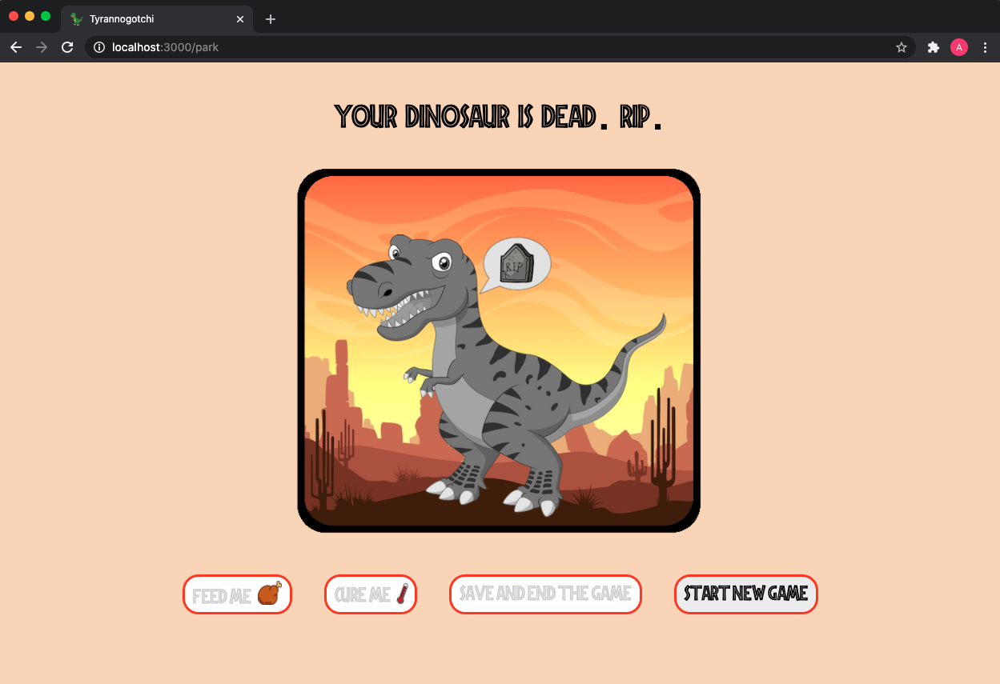

# Tyrannogotchi :t-rex:

CodeClan JavaScript/Java Group Project

### How to run the application

#### Backend
* Create a free [Okta Developer account](https://developer.okta.com/)
* Log in to your Okta account and navigate to Applications > Add Application
* Click Web and then Next
* Name your app and specify http://localhost:8080/login/oauth2/code/okta as a Login redirect URI
* Click Done, then click Edit to edit General Settings
* Add http://localhost:3000 and http://localhost:8080 as Logout redirect URIs, then save again
* Open backend folder with IntelliJ IDEA
* Create application.yml file inside src/main/resources
* Copy and paste the URI of your default authorization server, client ID, and the client secret and add it to the file like this: 

```java
spring:
  security:
    oauth2:
      client:
        registration:
          okta:
            client-id: {clientId}
            client-secret: {clientSecret}
            scope: openid, email, profile
        provider:
          okta:
            issuer-uri: https://{yourOktaDomain}.okta.com/oauth2/default
```
* Install the Lombok plugin in IntelliJ IDEA > Preferences > Plugins
* Run ```./mvnw spring-boot:run```  in the Terminal to start the backend of the app 

#### Frontend
* Run ```npm i``` in the Terminal
* ```npm install bootstrap@4.1.3 react-cookie@3.0.4 react-router-dom@4.3.1 reactstrap@6.5.0```
* Run ```npm start```  to start the frontend of the app 
* Open http://localhost:3000/

### The brief 

Tyrannogotchi is a browser game application where a user can create an account, choose dinosaurs to take care of by feeding and healing them and choose which pen they live in.

A user should be able to:

- Create an account
- Choose three dinosaurs from the database
- Have a choice of two pens to put their dinosaurs in
- Keep their dinosaurs happy, healthy and full, otherwise they'll die
- Save the game progress

### Extensions

- Random events such as all dinosaurs breaking out of their pens
- Score system where the user receives points for taking care of the dinosaurs
- Drag and drop for putting dinosaurs into the pens

### Technologies used

- JavaScript
- React
- Java
- Spring
- Okta
- CSS, Bootstrap

### Reflection

As we went along, we made some slight adjustments to our original brief. The time constraint for the app was one week and implementing and understanding OAuth 2.0 authentication took longer than expected. We kept the users ability to create an account and the save game persistence, but simplified the game. We decided that it would be best to start off with a more traditional tamagotchi game and keep some of the original ideas as possible extensions. 

When opening the Application the user is asked to log in:


Because we used Okta as our Authentication provider, after clicking the Login button the user is transferred to this page, where they can either sign in or sign up.


Once this process is completed, the user can start the game. If they never played before they will start from scratch, but if they already played Tyrannogotchi and saved it, they will return to the previous state of the game.

The dinosaur has three moods: happy, hungry or ill. Once the dinosaur is no longer happy, a user interaction is required to change the state back to happy. The user has a given time for this interaction othwerwise the dinosaur will die.


